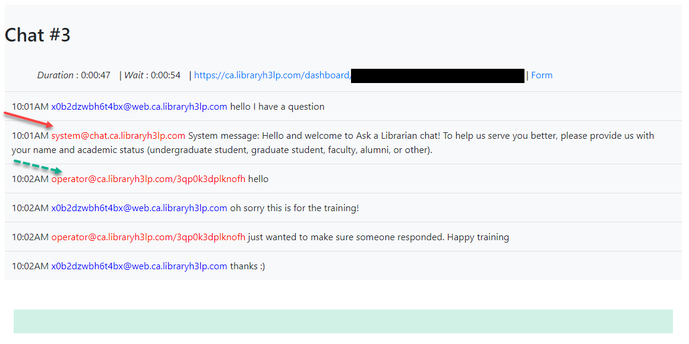

Sp Ask Transcript Downloader 
======================================================

  - Download Transcript from LibraryH3lp
  - Removing Operator and School name from the Metadata.

## Screenshots

<h3>Features</h3>

<ul>
    <li>- removing operator username from Scholars portal' Ask Transcript and replacing it by **operator**</li>
    <li>- 12:41PM **operator**@ca.libraryh3lp.com/yuxzl4a9vd69fj still looking</li>
    <li>- removing school name from Scholars portal' Ask Transcript and replacing it by **system**</li>
    <li>- 12:56PM **system**@chat.ca.libraryh3lp.com System message: guest navigated away from chat</li>
  <li>Creating files containing 60 chats each</li>
</ul>

<h3>Operating System</h3>

    OS X
    Unix based distro

<h3>Isntallation</h3>

    pip install -r requirements.txt

<h3>Usage</h3>

    from review import generate_html_template_from_transcript, write_html_to_template 

    output = generate_html_template_from_transcript([list, of , chat_id])
    filePath = "./templates/ask.html"
    write_html_to_template(output, filePath)

<h3>Testing</h3>

    python -m unittest tests.py
